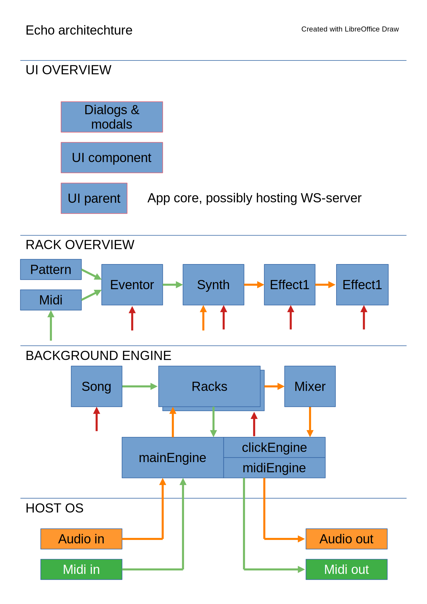

# echo
DSP breadboarding using PHP with goal to create a mobile DAW, similar to Caustic.

## Main objectives
* Preparing structure for upcoming C-project
* Exploring DSP filtering etc.
* Mocking UI of final app.

## Roadmap, (divided by milestones)
This roadmap **excludes** actions in JUCE or other C platform.
And remember, no work and all play folks! :)

## DOING
* Having a break

##TO DO
* Stabilize code.
* XML frontend rendering help tool
* FE dialogs for pattern & sample editing. XML based visuals.
* Simulate audio in using wav-file reading.
* "Synth" that can record or not record (but always effect process) audio in.
* Hack to play with settings for synths and effects using /www
---
* Stereo processing - how? Interleaved all the way? 
---

## DONE
* Push project to github (done)
* Get a drum machine in order (prototype ok)
* Have a catchy beat with two tracks playing by rendering. (done)
---
* Create example of event-processor-effect. (done)
* Raise PPQN to 96 or similar. (done)
* Swing implementation (done).
* Swing testing. Add quarter-note swing. (done)
---

## Requirements
To run project, have a PHP-cli installation, > PHP8.

* Test scripts are run from console
* The web-based synth-previewer works best by starting the built in server like:

 ~/echo/www # php -S 127.0.0.1:8080

## Remember
* Currently, everything is subject to change.
 

