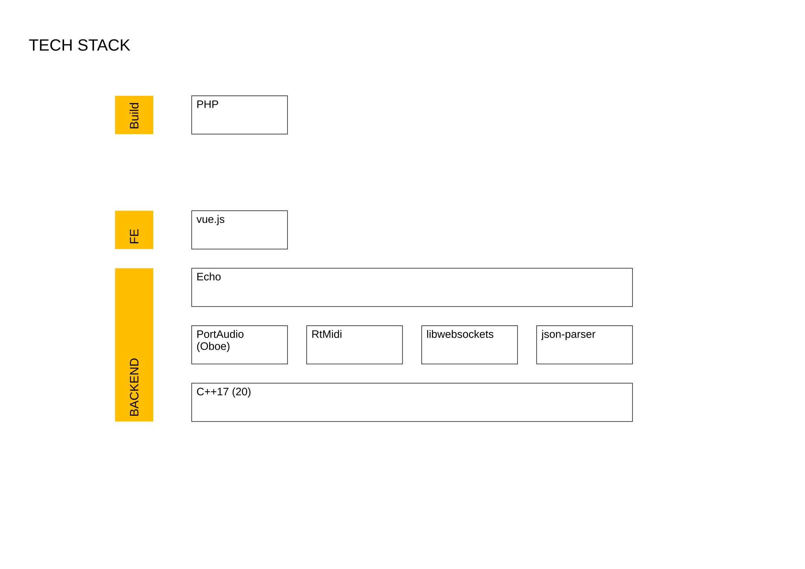
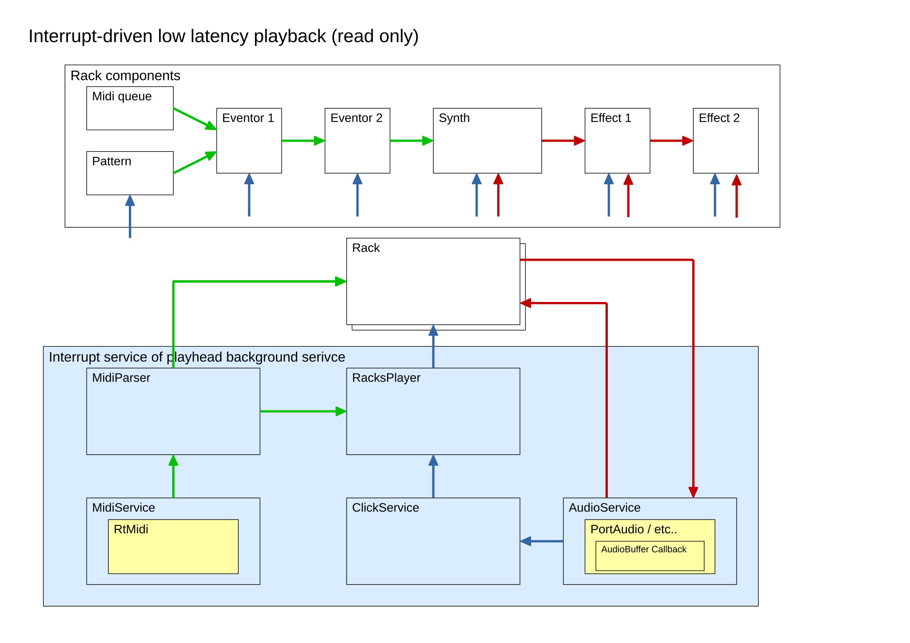
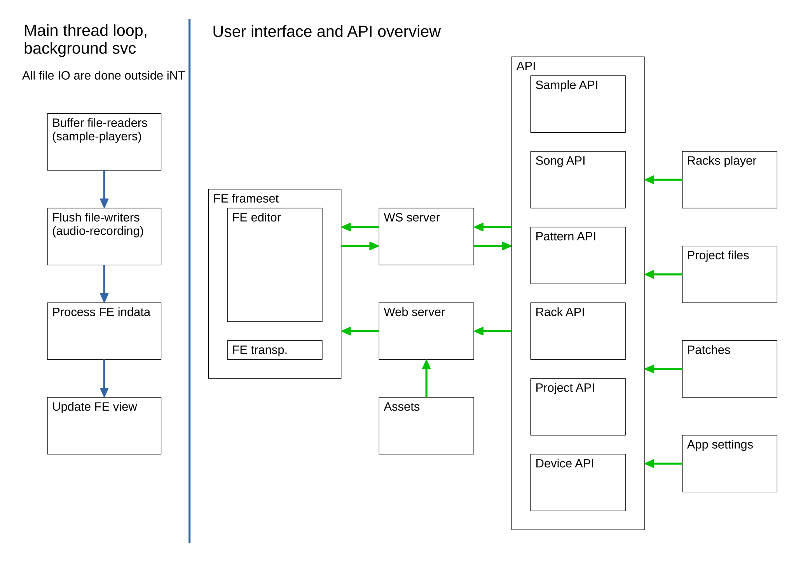

# echo
DSP breadboarding using PHP with goal to create a mobile DAW, similar to Caustic.

## Main objectives
* Preparing structure for upcoming C-project
* Exploring DSP filtering etc.
* Mocking UI of final app.

## Roadmap, (divided by milestones)
This roadmap **excludes** actions in JUCE or other C platform.
And remember, no work and all play folks! :)

## DOING & TO DO
* See document todo.txt (partially in swedish)

## Requirements
To run project, have a PHP-cli installation, > PHP8.

* Test scripts are run from console
* The web-based synth-previewer works best by starting the built in server like:

 ~/echo/www # php -S 127.0.0.1:8080

## Remember
* Currently, everything is subject to change.
 

